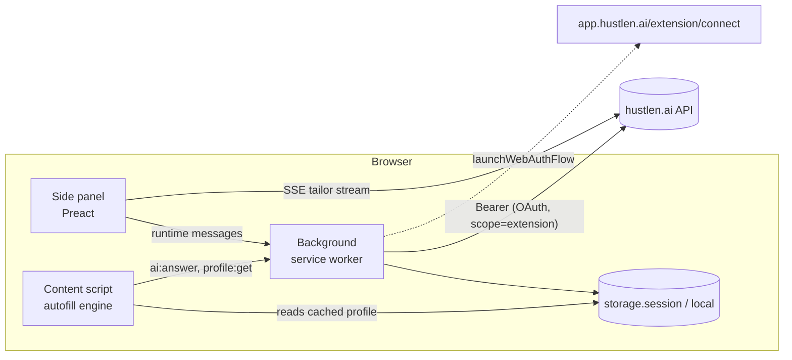

# hustlen.ai browser extension

> **Applying to jobs just got easier.** Autofill and track job applications from your hustlen.ai Master CV.

This is a Manifest V3 extension built with [WXT](https://wxt.dev), Preact for the side panel, and TypeScript. It builds for Chrome, Edge and Brave, and for Firefox as MV3.

Issue: brainxon/hustlen-ai-external-tools#1. Backend: brainxon/chamba-ai-backend-fastapi#300 (`REQ-EXT-001..003`). Consent page: brainxon/chamba-ai#420.

## What it does

| Feature | How |
|---|---|
| **Connect in one click** | OAuth 2.1 + PKCE through `chrome.identity.launchWebAuthFlow`, opening `app.hustlen.ai/extension/connect`. If you are already signed in to the web app, you only click **Connect**. The extension never sees a password. The access token lives in `storage.session` and the rotating refresh token in `storage.local`. |
| **Pick your CV** | Choose any Master CV (Root CV, one per language) or saved profile. By default it uses the English Root CV. |
| **Learns your answers** | With the user's opt-in, answers typed or corrected in a form are captured at Next/Submit and offered for saving. Recurring questions go to their field, the rest to custom answers. Matching is fuzzy and multi-language, with exact matches per company on the same ATS. Passwords, payment data, IDs and protected characteristics are never captured. |
| **Attaches your CV** | "Upload resume" fields get the job's reviewed tailored CV, or the Master CV PDF. |
| **Instant autofill** | Runs locally with no network call at fill time. The profile is cached, and a typical form fills in well under 50 ms. Fields are matched by `autocomplete`, then ATS attributes, then multi-language labels (en/de/es/fr/pt). It works with React/Vue inputs, selects, radio and checkbox groups, and custom comboboxes. It never overwrites a value, never ticks consent boxes, and never submits. |
| **Multi-ATS** | Adapters for Greenhouse, Lever, Workday, Ashby, SmartRecruiters, LinkedIn Easy Apply, Indeed, Workable, Personio and StepStone, plus a generic engine for any other site. Multi-step forms (Workday, Easy Apply) keep autofilling each new step for 15 minutes. |
| **Screening questions** | Answered in two tiers. (1) Your **answer bank** (work authorization, sponsorship, salary, notice period, custom Q&A) fills instantly. (2) Remaining open questions go in **one** batched call to `POST /api/extension/answer-questions`, grounded in your CV. Unsupported answers stay empty and are outlined **amber** for review. Protected-characteristic questions are only ever filled from your own answer bank. |
| **Save and track** | The job is extracted from the page you are on (JSON-LD `JobPosting`, then ATS selectors, then page text) and saved as an application without duplicates, looked up by normalized URL. **Mark as applied** sets it to `Submitted`. |
| **Tailor** | Runs **Tailor CV + letter** with live progress through the SSE pipeline, then offers to review and download in hustlen.ai. |

Shortcuts: `Alt+Shift+F` autofills the current page. `Alt+Shift+H` opens the panel.

## Publishing

See **[PUBLISHING.md](PUBLISHING.md)**: store accounts, the OAuth redirect ID, listing copy (en/de/es), permission justifications, privacy practices, review, Edge/Firefox and automated `wxt submit` (CWS API v2). The privacy policy to host is **[PRIVACY.md](PRIVACY.md)**.

## Develop

```bash
cd browser-extension
cp .env.example .env        # point at your local backend/frontend
npm install
npm run dev                 # Chrome with the extension loaded + HMR
npm run dev:firefox
npm test                    # vitest (jsdom)
npm run compile             # tsc --noEmit
npm run build:stg           # staging -> .output/chrome-mv3-staging ("hustlen.ai STG")
npm run build:prod          # production -> .output/chrome-mv3
npm run build:edge          # .output/edge-mv3
npm run build:firefox       # .output/firefox-mv3
npm run zip:stg             # staging zips to sideload (Chrome, Edge)
npm run zip:prod            # production zips to sideload (Chrome, Edge)
npm run zip:store           # store packages, no manifest key
```

**Environments.** Local builds read `.env` (copied from `.env.example`). Staging reads `.env.staging` and production reads `.env.production`; both are committed. Each environment has its own extension ID, OAuth redirect URI and backend allow-list. The server steps are in **[ENVIRONMENTS.md](ENVIRONMENTS.md)**.

### OAuth redirect URI (backend allow-list)

The backend only accepts redirect URIs listed in `EXTENSION_OAUTH_REDIRECT_URIS`. The extension's URI is `https://<extension-id>.chromiumapp.org/` on Chrome and Edge, and `https://<uuid>.extensions.allizom.org/` on Firefox. `WXT_MANIFEST_KEY` (a base64 public key) pins the ID. For staging and production, the IDs and URIs are listed in [ENVIRONMENTS.md](ENVIRONMENTS.md).

For local development, add your own ID to the local backend `.env`:

```
EXTENSION_OAUTH_CLIENT_ID=hustlen-extension
EXTENSION_OAUTH_REDIRECT_URIS=https://<extension-id>.chromiumapp.org/
```

## Architecture



- **No CORS change.** All API calls come from the service worker or the side panel. Both are extension contexts with `host_permissions` for the API origin. Content scripts never call the API.
- **Permissions.** Declared content scripts cover only the known ATS hosts. Any other site gets the script injected on demand through `activeTab`, triggered by the toolbar, the side panel or the shortcut. `tabs` lets the panel follow the active tab's URL.

| Path | Role |
|---|---|
| `src/lib/autofill/fields.ts` | Field discovery and label resolution (shadow DOM, groups) |
| `src/lib/autofill/matcher.ts` | Field-to-profile-key classification (multi-language) |
| `src/lib/autofill/values.ts` | Profile, CV and answer bank to value |
| `src/lib/autofill/fill.ts` | Framework-safe writes, option matching (countries, yes/no, ranges) |
| `src/lib/autofill/engine.ts` | Orchestration, screening questions, applying AI answers |
| `src/lib/autofill/adapters/` | Per-ATS hints and job selectors |
| `src/lib/extract/job.ts` | Job posting extraction and canonical URL |
| `src/lib/auth.ts`, `pkce.ts` | OAuth 2.1 + PKCE, token refresh |
| `src/lib/api.ts` | Typed REST client and SSE reader |

## Privacy

- Nothing is sent anywhere except the user's own hustlen.ai account.
- The only data leaving the browser is the job-posting text and the screening-question labels, and only when the user saves a job or uses AI answers.
- Contact data is never sent to the LLM. The backend strips it too (REQ-EXT-003).
- The profile cache lives in memory (`storage.session`) and is cleared when the browser closes.
